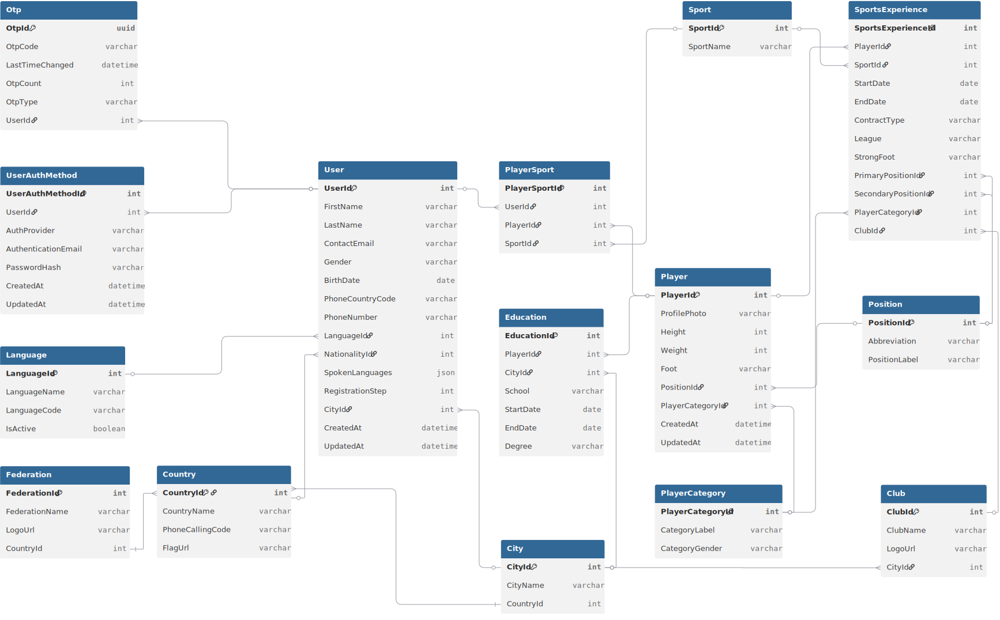

# Database Design

Single source of truth for the data model. Keep this in sync to avoid drift.

## ER Diagram

## Interactive Diagram
- View online: https://dbdiagram.io/d/68df591bd2b621e42213833c
- You can also visualize DBML/SQL using tools like [dbdiagram.io](https://dbdiagram.io) and [ChartDB](https://chartdb.io)

## Source Files
- DBML (authoritative model): [../DATABASE_DESIGN/ER.dbml](../DATABASE_DESIGN/ER.dbml)
- SQL schema (generated/applied): [../DATABASE_DESIGN/ER.sql](../DATABASE_DESIGN/ER.sql)

## Conventions
- Tables: PascalCase (e.g., PlayerProfile)
- Columns: camelCase (e.g., createdAt)
- Prefer explicit foreign keys and indexes for lookups

## Changes
- If you need to change the schema, contact me first to keep a single source of truth: [Email](mailto:houssameddine.haddouche@ilyara.com)
- Update the DBML, regenerate SQL.
